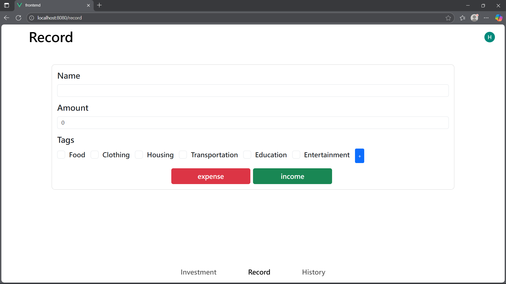
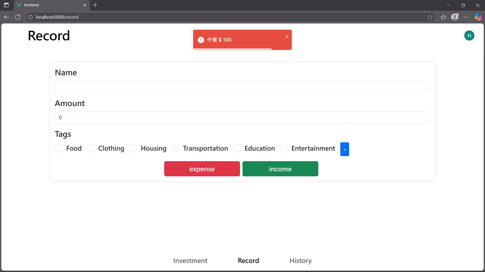
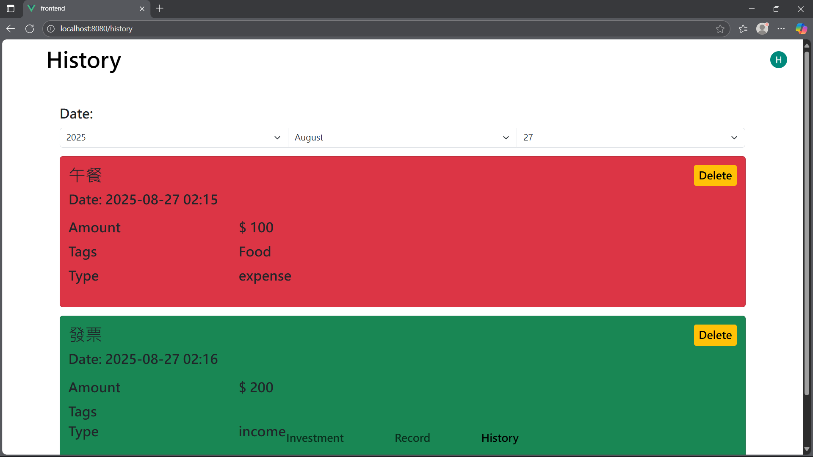
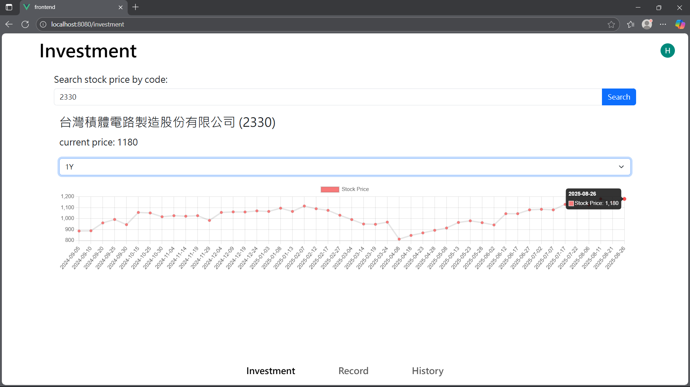

# EasyMoneyManager

[](https://easymoneymanager-4fe76.web.app/)

## 目錄
- [EasyMoneyManager](#easymoneymanager)
  - [目錄](#目錄)
  - [專案簡介](#專案簡介)
  - [主要功能](#主要功能)
  - [技術架構](#技術架構)
  - [環境變數與設定](#環境變數與設定)
    - [Firebase 服務帳戶金鑰](#firebase-服務帳戶金鑰)
    - [Google OAuth 2.0 設定說明](#google-oauth-20-設定說明)
      - [參數說明](#參數說明)
  - [部署與開發](#部署與開發)
    - [前端](#前端)
    - [後端](#後端)
  - [展示圖片](#展示圖片)
    - [記賬頁面](#記賬頁面)
    - [記錄頁面](#記錄頁面)
    - [股票頁面](#股票頁面)
  - [聯絡與貢獻](#聯絡與貢獻)

## 專案簡介
EasyMoneyManager 是一款簡易的記帳 Web App，支援 Google 登錄，並提供股價查詢功能。適合個人理財、投資記錄與查詢。


本專案可在本機運行測試，也可依說明自行部署。

- 線上體驗：[https://easymoneymanager-4fe76.web.app/](https://easymoneymanager-4fe76.web.app/)（僅供展示，後端可能需要時間重啟，也請勿用於長期記帳）

## 主要功能
- Google 帳號登入
- 記帳、消費記錄管理
- 股價查詢（台股）

## 技術架構
- 前端：Vue 3 + Vue Router + Bootstrap
- 後端：Python Flask（API 部署於 Render）
- 資料庫：Firebase Firestore
- 前端部署：Firebase Hosting
- 登入驗證：Google OAuth 2.0

## 環境變數與設定

請參考 `frontend/.env.example`，複製為 `.env.local` 或 `.env.production` 並填入自己的 Google Client ID 與 API Base URL。


### Firebase 服務帳戶金鑰

後端需使用 Firebase 服務帳戶金鑰檔案 `firebaseServiceAccountKey.json`，請至 Firebase 專案設定下載，並放在 `backend` 資料夾（或依程式指定路徑）。此檔案用於串接 Firestore 資料庫。

### 本機開發環境變數

若要在本機運行後端，請先設定環境變數：
- Linux/macOS: `export FLASK_ENV=development`
- Windows PowerShell: `$env:FLASK_ENV = "development"`

### Google OAuth 2.0 設定說明

本專案使用 Google OAuth 2.0 作為登入驗證，請依下列步驟申請並取得 Google Client ID：

1. 前往 [Google Cloud Console](https://console.cloud.google.com/) 並登入 Google 帳號。
2. 建立新專案或選擇現有專案。
3. 左側選單點選「API 與服務」→「憑證」。
4. 點選「建立憑證」→「OAuth 用戶端 ID」。
5. 選擇「網頁應用程式」，並設定授權的 JavaScript 來源（如 `http://localhost:8080` 或你的部署網址），以及授權的重新導向 URI（如 `http://localhost:8080`）。
6. 建立後即可取得 Client ID，請將其填入 `.env.local` 或 `.env.production` 的 `VUE_APP_GOOGLE_CLIENT_ID` 欄位。

> 詳細設定請參考 Google 官方文件：[OAuth 2.0 網頁應用程式設定](https://developers.google.com/identity/protocols/oauth2)

```env
VUE_APP_API_BASE_URL=your_api_url_here
VUE_APP_GOOGLE_CLIENT_ID=your_client_id_here
```

#### 參數說明

- `VUE_APP_GOOGLE_CLIENT_ID`：Google OAuth 2.0 登入用的 Client ID，需自行至 Google Cloud Console 申請。
- `VUE_APP_API_BASE_URL`：前端呼叫後端 API 的網址。
	- 本機測試時請設為 `http://localhost:5000`（後端 Flask 預設埠號）。
	- 部署時請改為你的後端服務網址（如 Render 部署網址）。

## 部署與開發

### 前端
```bash
cd frontend
npm install
npm run serve # 本地開發
npm run build # 建立 production 靜態檔
```

### 後端
```bash
cd backend
python -m venv .venv
.\.venv\Scripts\Activate # Windows
pip install -r requirements.txt
 
# 本機運行前，請設定環境變數：
# Linux/macOS: export FLASK_ENV=development
# Windows PowerShell: $env:FLASK_ENV = "development"
python main.py
```

## 展示圖片


### 記賬頁面


### 記錄頁面


### 股票頁面


---

## 聯絡與貢獻

歡迎 issue、PR 或聯絡作者。

[(Back to top)](#目錄)
